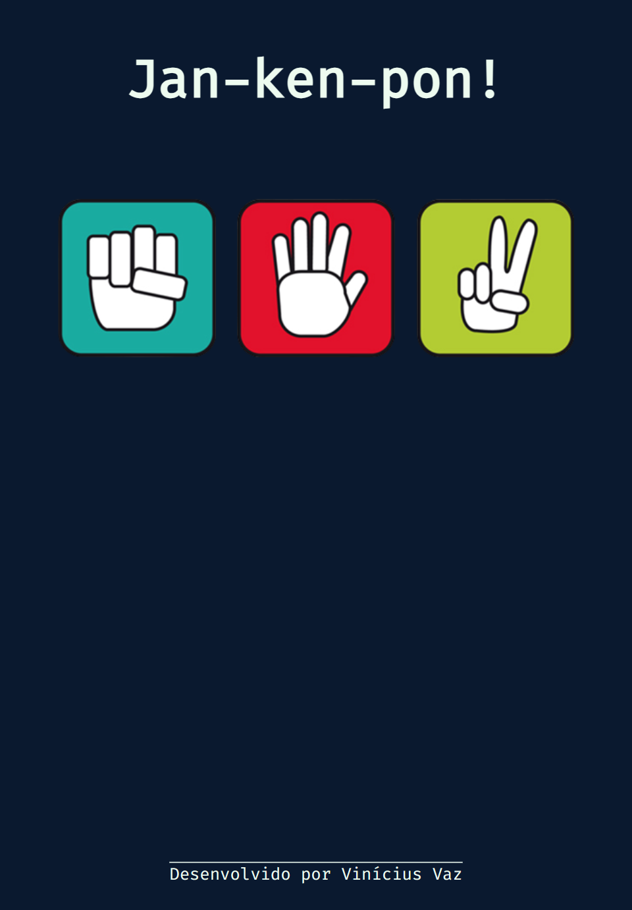
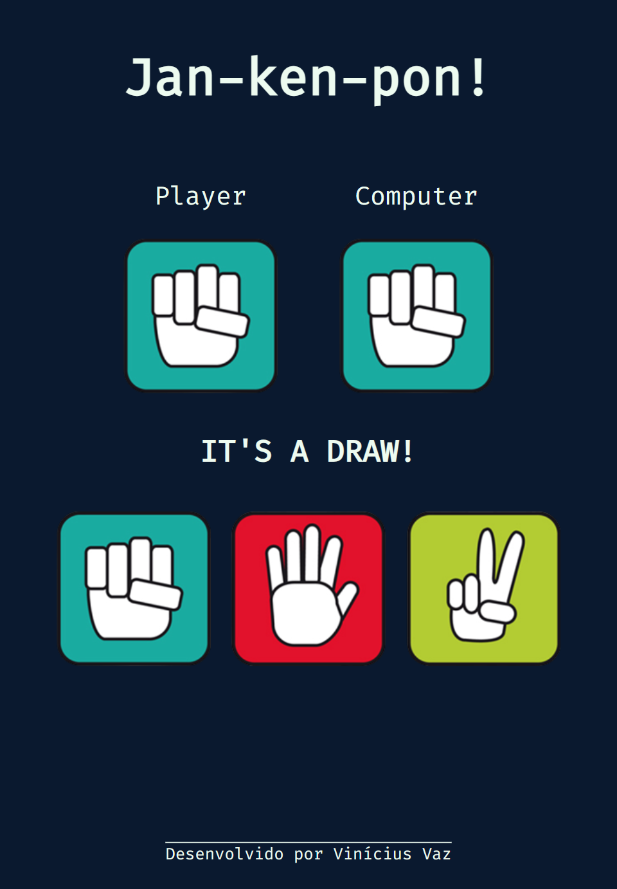
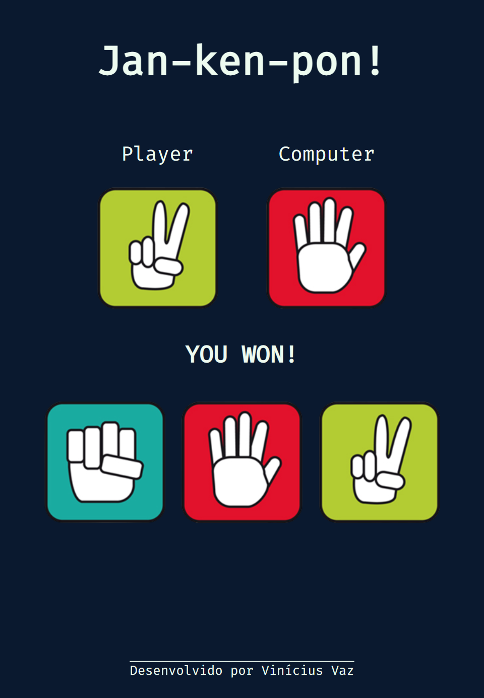

<h1 align='center'>This is a rock-paper-scissors game</h1>

   
   
   
   

<h3>JavaScript Properties and Methods cover:</h3>
<ul>
  <li>.querySelectorAll()
  <li>.querySelector()
  <li>.forEach()
  <li>.addEventListener()
  <li>.innerHTML
  <li>e.target.id
  <li>.Math.floor()
  <li>.Math.random()
</ul>

<h4>The seven games will be listed at their difficult levels wich will be:</h4>
<ol>
  <li>Rock Paper Scissors
  <li>Memory Game
  <li>Whac-a-mole
  <li>Breakout
  <li>Frogger
  <li>Connect Four
  <li>Space Invaders
</ol>
